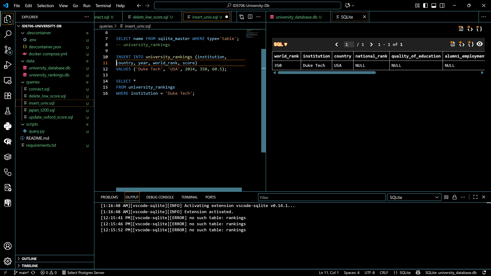
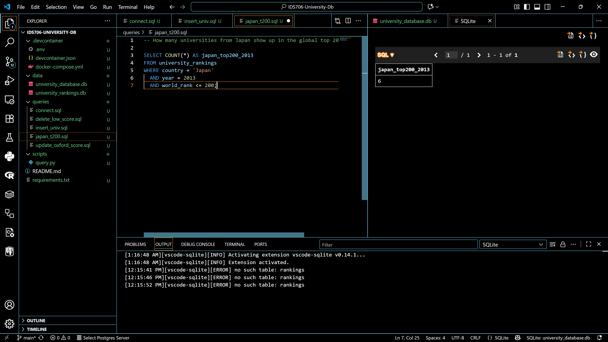
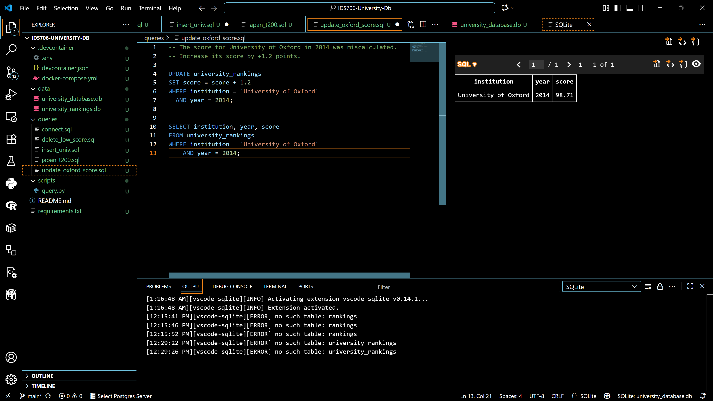
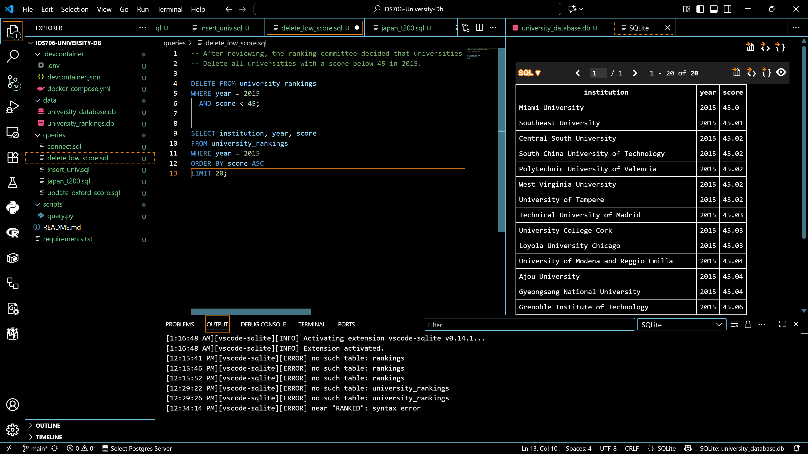
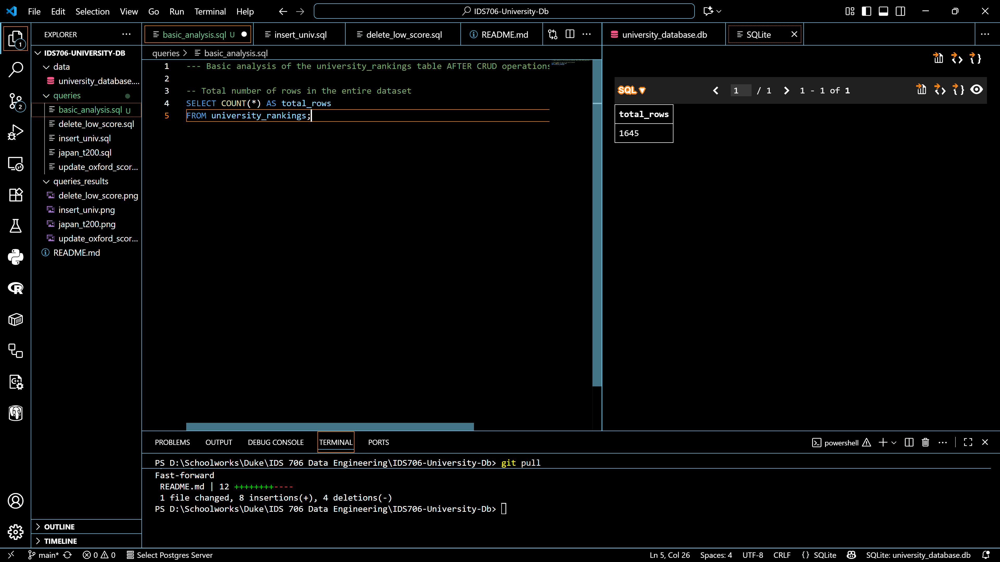
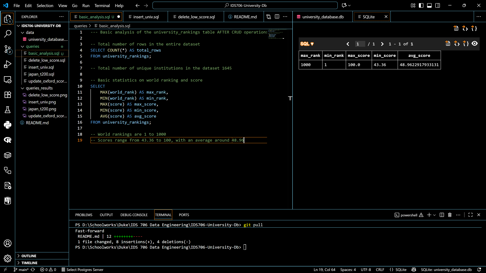
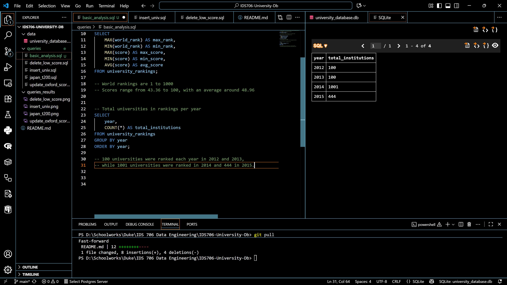
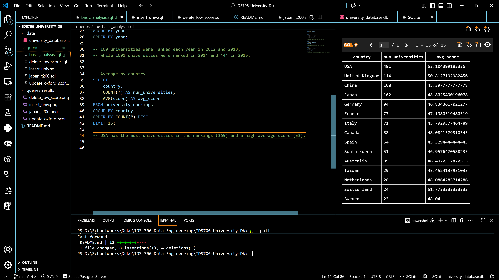

# IDS706-University-Db

## Objective
To explore a relational database using SQLite, perform analysis, and practice CRUD operations.

## Steps
1. Connected to SQLite database using `sqlite3` CLI on Windows.
2. Explored structure using `.tables`
3. Performed CRUD operations as follows:

### Create
- Inserted Duke Tech (USA, 2014, rank 350, score 60.5).
- 

### Read (Analysis)
- Counted number of Japanese universities in top 200 (2013): **6**
- 

### Update
- Increased University of Oxford 2014 score by +1.2: **New score: 98.71**
- 

### Delete
- Removed all universities in 2015 with score < 45.
- 

## Basic Analyis (after CRUD operations)

#### Total number of unique institutions in the dataset 1,645
- 

#### Basic statistics on world ranking and score
- 
- World rankings are 1 to 1000
- Scores range from 43.36 to 100, with an average around 48.96

#### Total universities in rankings in each year
- 

#### Count of universities ranked and average score by country
- 
- USA has the most universities in the rankings (365) and a high average score (53).

## Files Included
- `queries/basic_analysis.sql`
- `queries/insert_university.sql`
- `queries/japan_top_200.sql`
- `queries/update_oxford_score.sql`
- `queries/delete_low_scores.sql`
- `README.md`

## Tools
- SQLite3 CLI
- VS Code
